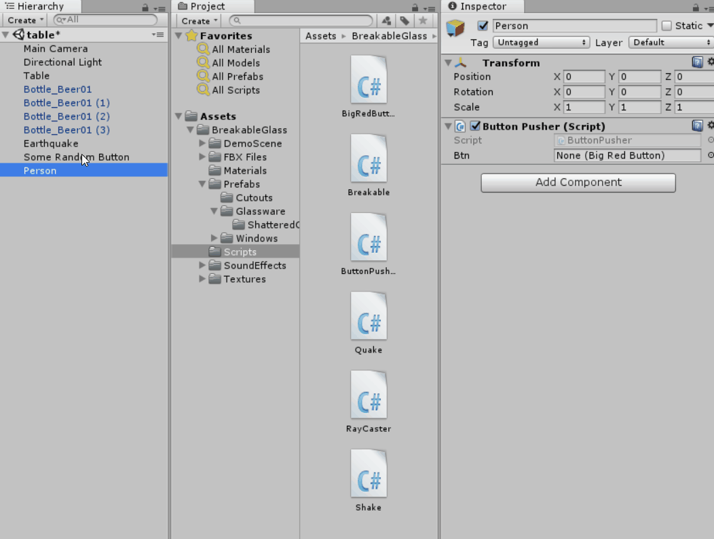

# How to call a function from another script

You can call funtions from other scripts like this:

```c#
using UnityEngine;

public class ButtonPusher : MonoBehaviour
{
  public BigRedButton btn;

  public void Update()
  {
     if(time_to_push_button)
     { 
        btn.Push();
     }
  }
}
```
*Note: The syntax hilighting strikes out above because GitHub's syntax formatting treats this code directly as c#. This code runs fine from Unity. If you know how to make it understand that we're in Unity's context, please let me know.*

if some there exists a gameobject with a script called BigRedButton attached to it. The script might look like this:

```c#
using UnityEngine;
public class BigRedButton : MonoBehaviour
{
  public void Push()
  {
     Debug.Log("That was easy");
  }
}
```

You set the public variable btn in the GameObject in the Unity editor:



